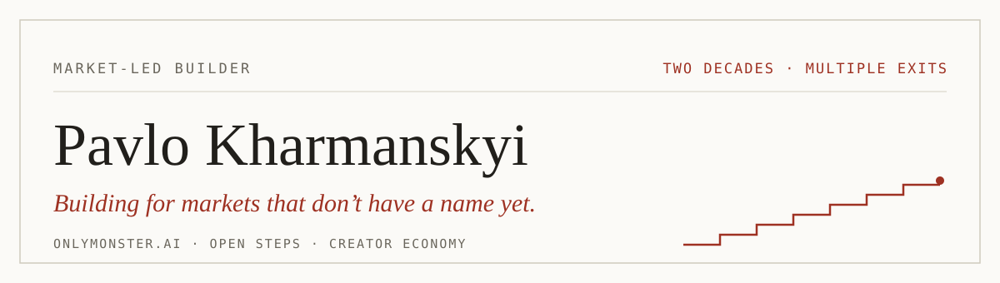

<a href="https://opensteps.ai">
  <picture>
    <source media="(prefers-color-scheme: dark)" srcset="dark_mode.svg">
    <source media="(prefers-color-scheme: light)" srcset="light_mode.svg">
    
  </picture>
</a>

<h3 align="center">Technology entrepreneur &middot; Founder of <a href="https://onlymonster.ai">OnlyMonster.ai</a> &middot; Author of <a href="https://opensteps.ai">Open Steps</a></h3>

<p align="center">
Two decades of creating and scaling businesses across digital marketing, e-commerce,<br>
fintech, Web3 and the creator economy. Multiple ventures, acquisitions and exits.
</p>

<p align="center">
  <a href="https://kharmanskyi.com"></a>&nbsp;
  <a href="https://www.linkedin.com/in/kharmanskyi/"></a>&nbsp;
  <a href="https://www.instagram.com/harmansky"></a>
</p>

---

## About

- 🧭 **Market-led builder.** I look for where demand is forming, get close to the community, and build the product around what it actually needs.
- 🚀 Founder of **[OnlyMonster.ai](https://onlymonster.ai)** — one of the leading software providers for the creator economy, serving thousands of customers worldwide.
- 📐 Author of **[Open Steps](https://opensteps.ai)** — my own method for building products with AI coding agents, written down and made installable.
- 🏦 Currently building fintech infrastructure for digital businesses: verification, payouts and the movement of funds across payment platforms.
- ⚡ Started at 13, selling newspapers on roller skates. First exits by 25.

## Open Steps — plain-language skills for Claude Code

A free pack of skills for coding agents — my product-building method, written down. It turns agent jargon into plain language: honest reports, straight verdicts, steps you can follow. For the person running the build, not reading the code.

```bash
git clone https://github.com/kharmanskyi/open-steps.git
claude plugin marketplace add ./open-steps && claude plugin install open-steps@open-steps
```

**[opensteps.ai](https://opensteps.ai)** &middot; **[kharmanskyi/open-steps](https://github.com/kharmanskyi/open-steps)** &middot; MIT, free
